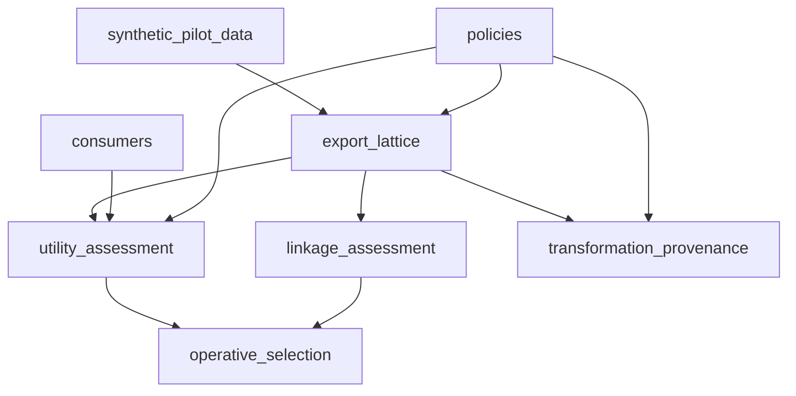

# Open SBB layout plan — understandability, applicability, adaptability

**Status:** Brainstorm / long-term design  
**Adopted for v0.1.1:** **Adoption-first doc map** — see [`README.md`](README.md), [`../docs/`](../docs/), [`../examples/`](../examples/). **Do not move Python code** until v0.2.  
**Audience:** Maintainers, contributors, external adopters  
**Scope:** `open-semantic-boundary-benchmark/` only  

---

## Why this document exists

The paper (§4 *Open Semantic Boundary Benchmark*) describes a **protocol**: export lattice → policies & consumers → synthetic pilot → utility & linkage assessment → operative selection → transformation provenance.

The repository today is organized as a **software pipeline**: `src/` + `data/` + `outputs/` + top-level `eval/` scripts. That layout is efficient for developers who already know the codebase, but it forces newcomers to reverse-engineer which code touches which artifact.

**Goals for a world-class public repo:**

| Goal | What adopters need |
|------|-------------------|
| **Understandability** | Walk paper §4 left-to-right; find README + artifacts in the matching folder |
| **Applicability** | Bring your own exports: know exactly where inputs go and which assessor runs |
| **Adaptability** | Add a lattice arm, purpose, or domain without hunting across six top-level trees |

This plan keeps the **`src/` / `data/` / `outputs/` triad** you liked, but **nests it under protocol modules** instead of one global jumble.

---

## Where we are today (v0.1.1 bootstrap)

### Top-level shape (~477 MB with venv; ~18 MB archived without venv)

```
open-semantic-boundary-benchmark/
├── Makefile, pyproject.toml, configs/pilot_v0.1.1.yaml
├── src/           # all Python packages (generate, transform, boundary, eval, sbb)
├── eval/          # CLI study runners (obs, analytics, figures, bootstrap, operative)
├── scripts/       # pipeline helpers, cache warming, Ollama
├── tests/         # full suite (~100+ tests)
├── data/          # everything frozen + caches (flat by type, not by protocol)
│   ├── raw, ground_truth
│   ├── policies, schemas
│   ├── transformed, transformed_analytics
│   ├── eval_cache, eval_cache_analytics, llm_transform_cache
└── outputs/pilot_v2/   # published numbers, figures, operative bundles
```

### Paper concept → current location (the navigation problem)

| Paper §4 module | Role | Code today | Data today | Outputs today |
|-----------------|------|------------|------------|---------------|
| **Export lattice** | Materialize \(z,r\) for each \(c \in \mathcal{C}\) | `src/transform/`, `eval/run_*` (partial) | `data/transformed/`, `data/transformed_analytics/`, `data/llm_transform_cache/` | (embedded in eval metrics) |
| **Policies & consumers** | \(\pi\), schemas, frozen assessors | `src/eval/tier*_consumer.py`, `src/boundary/policy_check.py` | `data/policies/`, `data/schemas/` | LLM consumer predictions in `data/eval_cache*` |
| **Synthetic pilot** | Corpus \(W\), split, labels | `src/generate/` | `data/raw/`, `data/ground_truth/` | — |
| **Utility assessment** | `assess_utility` → \(U(T,z)\) | `src/eval/observability_task.py`, `analytics_task.py`, `eval/run_obs_study.py`, `run_analytics_study.py` | eval caches | `outputs/pilot_v2/metrics.json`, `analytics_metrics.json` |
| **Linkage assessment** | `assess_risk` → \(R(z)\) | `src/eval/adversary*.py`, linkage in study runners | same transforms | linkage columns in metrics + `figures/linkage_*` |
| **Operative selection** | Pareto, \(R_{\max}\), bundles | `src/eval/operative_selection.py`, `eval/run_operative_selection.py` | — | `outputs/pilot_v2/operative_selection/` |
| **Transformation provenance** | \(\tau\), `verify` | `src/boundary/verify.py`, `cross.py`, `provenance_score.py` | `examples/provenance/` | `boundary_bundle_v0.json`, completeness in metrics |

**Pain points:**

1. **Horizontal slicing** — `src/eval/` owns utility, linkage, operative, and figures; hard to see protocol boundaries.
2. **Vertical scattering** — lattice *data* under `data/transformed/` but lattice *code* under `src/transform/`; consumer *code* in `src/eval/` but *cache* in `data/eval_cache/`.
3. **Naming drift** — paper says Open SBB v0.1.1; artifacts live in `outputs/pilot_v2/`; config is `pilot_v0.1.1.yaml`.
4. **No module READMEs** — root README is one page; paper has seven subsections with no 1:1 repo map.

### What works well (keep)

- **`make eval` / `make figures`** repro path on committed artifacts
- **Frozen tier** committed in git (transforms + caches + metrics snapshot)
- **Single install** (`uv pip install -e ".[dev]"`) and one config file
- **Tests** colocated at repo root (standard Python OSS)

---

## Target: protocol modules with local `src/` · `data/` · `outputs/`

### Design principle

> Each protocol module is a **self-describing unit**: README explains the paper subsection, inputs, outputs, and repro command; subfolders hold code and artifacts for *that* module only.

Shared orchestration (`Makefile`, config, package entrypoints) stays at repo root until v0.2 CLI.

### Proposed tree (world-class target)

```
open-semantic-boundary-benchmark/
├── README.md                    # clone → repro in 5 minutes
├── Makefile                     # dispatches to module targets + legacy aliases
├── configs/pilot_v0.1.1.yaml    # paths point into open-sbb/*/data|outputs
├── pyproject.toml
├── tests/                       # integration tests; module unit tests optional under each src/
│
└── open-sbb/
    ├── README.md                # paper §4 map + dependency graph between modules
    │
    ├── export_lattice/
    │   ├── README.md            # §4.1 — nine conditions, counterfactual fairness
    │   ├── src/                 # transform runners, lattice materialize (from src/transform/)
    │   ├── data/                # transformed/, transformed_analytics/, llm_transform_cache/
    │   └── outputs/             # optional per-arm manifests, checksums
    │
    ├── policies/
    │   ├── README.md            # §4.2 (policy half) — π, schemas, combination guards
    │   ├── data/                # policies/*.json, schemas/*.json
    │   └── src/                 # policy_check, schema validation (thin)
    │
    ├── consumers/
    │   ├── README.md            # §4.2 (consumer half) — frozen LLM + classical baseline contracts
    │   ├── src/                 # tier0_consumer, tier1_consumer, tier1_analytics_consumer (legacy names)
    │   ├── data/                # eval_cache/, eval_cache_analytics/
    │   └── outputs/             # optional sensitivity merge artifacts
    │
    ├── synthetic_pilot_data/
    │   ├── README.md            # §4.3 — seed 42, 100 personas, 630 test events
    │   ├── src/                 # generate/* corpus, validate, splits
    │   ├── data/                # raw/, ground_truth/
    │   └── outputs/             # validation reports, split manifest + SHA256
    │
    ├── utility_assessment/
    │   ├── README.md            # §4.4 utility — assess_utility, task matrix
    │   ├── src/                 # observability_task, analytics_task, study glue
    │   ├── data/                # (reads lattice + consumers; may symlink or config-ref)
    │   └── outputs/             # metrics.json, analytics_metrics.json, utility figures
    │
    ├── linkage_assessment/
    │   ├── README.md            # §4.4 linkage — R(z), Trial4 adversaries, channels
    │   ├── src/                 # adversary*, embeddings, retention helpers
    │   ├── data/                # adversary train refs if any
    │   └── outputs/             # linkage decomposition figures, channel CSVs
    │
    ├── operative_selection/
    │   ├── README.md            # §4.5 — Pareto, R_max, cross-purpose regret
    │   ├── src/                 # operative_selection, operative_figures
    │   ├── data/                # —
    │   └── outputs/             # operative_selection/, regret matrices
    │
    └── transformation_provenance/
        ├── README.md            # §4.6 — τ, verify, BYO (z,r) examples
        ├── src/                 # boundary/verify, cross, provenance_score
        ├── data/                # examples/provenance/ (or keep at repo examples/)
        └── outputs/             # boundary_bundle_v0.json, completeness reports
```

**Cross-cutting at repo root (unchanged role):**

- `eval/` — thin CLI wrappers that call module `src/` (or merge into each module as `bin/`)
- `scripts/` — Ollama, pipeline, cache consolidate
- `tests/` — full regression until per-module tests mature

---

## Pros and cons

### Protocol modules + local src/data/outputs

| Pros | Cons |
|------|------|
| **Paper parity** — reviewer reads §4.2, opens `policies/` + `consumers/` | **Large one-time move** — every import path, config path, test fixture |
| **Locality** — “change linkage” → one folder | **Duplication risk** — lattice data referenced by utility *and* linkage |
| **BYO clarity** — adopters drop files in module `data/` | **Config complexity** — `pilot_v0.1.1.yaml` must list 7 base paths or use convention |
| **Incremental READMEs** — each module documents frozen tier | **Python packaging** — `pyproject` must still expose one installable package (or namespace packages) |
| **Adaptability** — new domain = new subtree pattern | **CI time** — more paths to checksum and verify |
| **Zenodo/archival** — tarball reads like the protocol spec | **Migration period** — need compatibility shims (`make eval` must not break) |

### Alternative A — README map only (no moves)

| Pros | Cons |
|------|------|
| Zero repro risk | Does not fix “jumbled mass” feeling |
| Can ship this week | Adopters still hunt paths |
| Good v0.1.1 stopgap | Not world-class long term |

### Alternative B — move `data/` + `outputs/` only; keep `src/` unified

| Pros | Cons |
|------|------|
| Artifacts match paper; code stays import-stable | Code/data still split across folders |
| Medium effort | Utility module README says “code is elsewhere” |

### Alternative C — full move (target above)

| Pros | Cons |
|------|------|
| Best understandability / applicability / adaptability | Highest effort; target v0.2+ |

**Recommendation:** **A now → B for v0.1.1 artifact layout → C for v0.2** with frozen v0.1.1 repro guarded by checksum tests throughout.

---

## Applicability: how BYO would read (target state)

Example: external team evaluates their own bracket-redacted exports for observability.

1. Read `open-sbb/export_lattice/README.md` — condition ID must be `redact_bracket` (or register new arm in v0.2).
2. Place `events.jsonl` under `open-sbb/export_lattice/data/redact_bracket/`.
3. Read `open-sbb/policies/README.md` — ship matching `obs_policy_v1.json` + schema.
4. Read `open-sbb/consumers/README.md` — run classical baselines or supply cached LLM consumer predictions.
5. Run `make utility-assess PURPOSE=obs` (future) → outputs land in `utility_assessment/outputs/`.
6. Run linkage + operative modules similarly.

Today that path is documented under `open-sbb/*/README.md` and [`../docs/`](../docs/).

---

## Adaptability: extension points (target state)

| Extension | Natural home | v0.1.1 today |
|-----------|--------------|--------------|
| New lattice arm | `export_lattice/` + semver note | Edit `configs` + `src/transform/` |
| New purpose \(T\) | `policies/` + `consumers/` + utility tasks | Hard-coded analytics vs obs |
| New adversary | `linkage_assessment/src/` | `adversary_trial4.py` |
| New operative rule | `operative_selection/src/` | `operative_selection.py` |
| Learned `sem_*` | `export_lattice/` adapter slot | Explicitly out of scope v0.1.1 |

---

## What “world-class” means (checklist)

### Navigation & docs

- [ ] `open-sbb/README.md` — diagram: module → paper § → repro command
- [ ] Each module README: purpose, frozen inputs, expected outputs, checksum, “not claimed”
- [ ] Root README: 5-minute repro + link to `open-sbb/`
- [ ] No stale names (I0, CIKM-only paths) in public tree

### Repro & trust

- [ ] `make repro-smoke` diffs headline metrics vs committed snapshot (no Ollama)
- [ ] Split manifest + SHA256 in `synthetic_pilot_data/outputs/`
- [ ] `boundary_bundle_v0.schema.json` in `transformation_provenance/data/`
- [ ] External smoke recorded (non-team clone)

### Engineering

- [ ] One `pip install`; config resolves all module paths
- [ ] CI green on PR; module path checksum job optional
- [ ] Tag `sbb-obs-0.1.1` matches paper cite string
- [ ] CITATION.cff + Zenodo DOI + arXiv ID aligned

### Adaptability (v0.2+)

- [ ] `opensbb evaluate` CLI hides internal paths
- [ ] Domain registration doc + issue template
- [ ] Results manifest JSON for submissions

---

## Migration phases (effort estimate)

| Phase | Deliverable | Effort | Repro risk |
|-------|-------------|--------|------------|
| **0 — Now** | This document + `open-sbb/README.md` stub map | 0.5 day | None |
| **1 — Doc map** | 7 module READMEs pointing at *current* paths | 1 day | None |
| **2 — Artifact move** | Relocate `data/` + `outputs/` under modules; update config + Makefile | 2–3 days | Medium — path bugs |
| **3 — Code move** | Relocate `src/` packages under modules; fix imports & tests | 3–5 days | High |
| **4 — CLI & packaging** | Module-scoped make targets; optional `opensbb` entrypoint | 2–4 days | Medium |
| **5 — Hardening** | repro-smoke, checksums, external smoke, tarball layout | 2–3 days | Low |

**Total to world-class layout (phases 1–5):** ~2–3 contributor-weeks, assuming metrics parity tests gate every phase.

### Phase 2 detail (likely best next step after repro-smoke passes)

Move without touching Python package roots initially:

```
open-sbb/export_lattice/data/          ← data/transformed*, llm_transform_cache
open-sbb/synthetic_pilot_data/data/  ← data/raw, ground_truth
open-sbb/policies/data/              ← data/policies, schemas
open-sbb/consumers/data/             ← data/eval_cache*
open-sbb/utility_assessment/outputs/ ← metrics.json, analytics_metrics.json, utility figures
open-sbb/linkage_assessment/outputs/   ← linkage figures
open-sbb/operative_selection/outputs/← operative_selection/
```

Update `configs/pilot_v0.1.1.yaml` `paths:` block only. Keep `src/` at repo root until phase 3.

### Phase 3 detail (imports)

Options:

1. **Namespace packages** — `open_sbb.export_lattice.transform` under module `src/`
2. **Single package, subpaths** — keep `src/transform/` but symlink from module (not recommended for Zenodo)
3. **Engine layer** — `src/sbb/engine/` shared; modules own thin wrappers (roadmap v0.2 vision)

Prefer **(1)** or **(3)** for long-term adaptability.

---

## Dependency graph (modules)



Operative selection **reads** utility + linkage scores; provenance **validates** each lattice arm independently.

---

## Naming alignment (paper vs repo)

| Name | Meaning | Recommendation |
|------|---------|----------------|
| Open SBB **v0.1.1** | Citeable protocol release | Keep in README, CITATION.cff, tag `sbb-obs-0.1.1` |
| **pilot_v2** | Historical run directory | Keep for repro parity; alias in docs as “v0.1.1 published run” |
| **pilot_v0.1.1.yaml** | Config filename | Good; paths should eventually live under `open-sbb/` |
| **boundary_bundle_v0** | Bundle schema generation | Stays in provenance module |

Do **not** rename `outputs/pilot_v2/` before a semver-major release unless checksum migration is scripted and downstream figure paths updated.

---

## Decision log

Rows marked **TBD** are intentional open questions for **future repository versions** (v0.2+ module nesting). They do not block the v0.1.1 release: the adopted path is the adoption-first doc map with flat `src/`, `eval/`, and `outputs/pilot_v2/` (see header above).

| Question | Options | v0.1.1 | Future (v0.2+) |
|----------|---------|--------|----------------|
| Repo root name at public export | `open-semantic-boundary-benchmark` vs `open-sbb` | **`open-semantic-boundary-benchmark`** | TBD (short alias in docs only?) |
| Move code before v0.2? | yes / no / partial (data only) | **no** — docs only under `open-sbb/` | TBD (full module nest vs partial data moves) |
| Keep top-level `eval/`? | yes (wrappers) / merge into modules | **yes** — current wrappers | TBD |
| Per-module tests? | later / never | defer | TBD |

---

## Immediate next steps (suggested)

1. **Confirm repro** on current flat layout (`make repro-smoke`; optional `make eval` vs `metrics.json`).
2. **Phase 1:** module READMEs under `open-sbb/` (links only, no moves) — **done for v0.1.1**.
3. **Maintainer review** of this plan; pick Phase 2 vs wait for v0.2.
4. Only then execute artifact or code moves with a path-migration PR and `make repro-smoke` gate.

---

*This file is planning only. Implementation must stay within `open-semantic-boundary-benchmark/` and must not break committed headline metrics without an explicit semver bump and changelog entry.*
